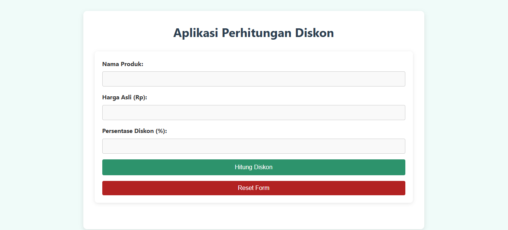

# DiskonKu - Aplikasi Perhitungan Diskon

DiskonKu adalah sebuah aplikasi web yang memungkinkan pengguna untuk menghitung diskon pada produk. Aplikasi ini menerima input berupa nama produk, harga asli, dan persentase diskon. Setelah itu, aplikasi akan menampilkan hasil perhitungan berupa harga setelah diskon.

## Fitur
- Menghitung diskon berdasarkan harga asli dan persentase diskon.
- Menampilkan bukti transaksi yang dapat dicetak atau disalin.
- Tampilan yang responsif dan user-friendly.

## Teknologi yang Digunakan
- **HTML**: Struktur dasar halaman web.
- **CSS**: Styling untuk mempercantik tampilan.
- **PHP**: Untuk logika perhitungan dan validasi diskon.
- **JavaScript**: Fitur untuk menyalin bukti transaksi.

## Cara Menjalankan Aplikasi
1. **Clone repository** ini ke komputer kamu:
2. Pastikan kamu sudah menginstal **XAMPP** atau **WAMP** di komputer untuk menjalankan aplikasi berbasis PHP.
3. Pindahkan folder `Diskonku` ke dalam folder `htdocs` di direktori instalasi XAMPP/WAMP.
4. Buka **localhost** di browser dan akses `http://localhost/Diskonku/`.
5. Sekarang kamu bisa menggunakan aplikasi untuk menghitung diskon produk!

## Cara Menggunakan Aplikasi
1. Isi formulir dengan **nama produk**, **harga asli**, dan **persentase diskon**.
2. Klik tombol **Hitung Diskon** untuk melihat hasil perhitungan.
3. Aplikasi akan menampilkan **bukti transaksi**, yang bisa dicetak atau disalin.

## Screenshot

Berikut adalah tampilan aplikasi **DiskonKu**:

## Kontribusi
Jika kamu ingin berkontribusi pada proyek ini, kamu bisa melakukannya dengan mengirimkan pull request. Pastikan untuk membuat branch baru untuk fitur atau perbaikan yang kamu buat.

## Hubungi
Jika ada pertanyaan atau masukan, kamu bisa menghubungi saya di:
- **Email**: muhammadmirzarahmansyahh@gmail.com
- **GitHub**: [muhammadmirzarahmansyah](https://github.com/muhammadmirzarahmansyah)

---

Terima kasih telah mengunjungi repository ini! 😊
